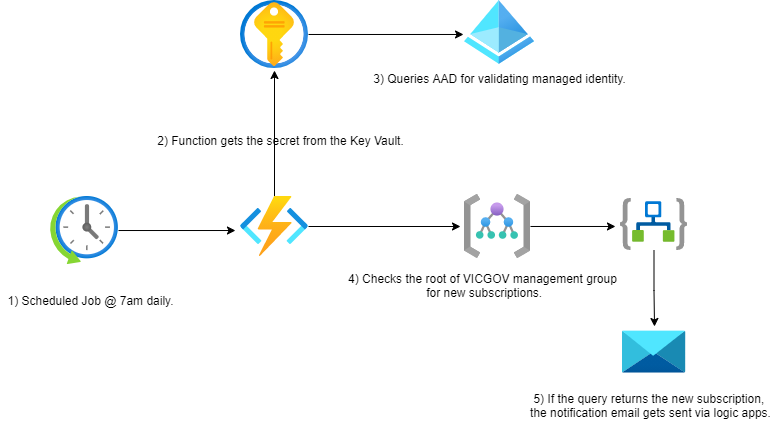

# VICGOV - New Subscription notification
## 1. Introduction
### 1.1	Overview

A number of challenges arise when managing over 100+ subscriptions across multiple tenants, Hosting Services team have been working to make this process easier to maintain with less administrative overhead.

This document is intended to provide a high level overview of workflow on how the automation notifies the admins for new subscriptions in VICGOV so that the rest of onboarding pipeline can be processed accordingly.

Included in this report is a step by step detailed guide around where to look for troubleshooting.

## 2 Logical Architecture
### 2.1	Logical System Component Overview

1. Scheduled Job @ 7am daily.
2. Function retreives the secrets from the Keyvault.
3. Queries AAD for validating managed identity.
4. Checks the root of management group for new subscriptions.
5. If the query returns the new subscription, the notification email gets sent via logic apps.